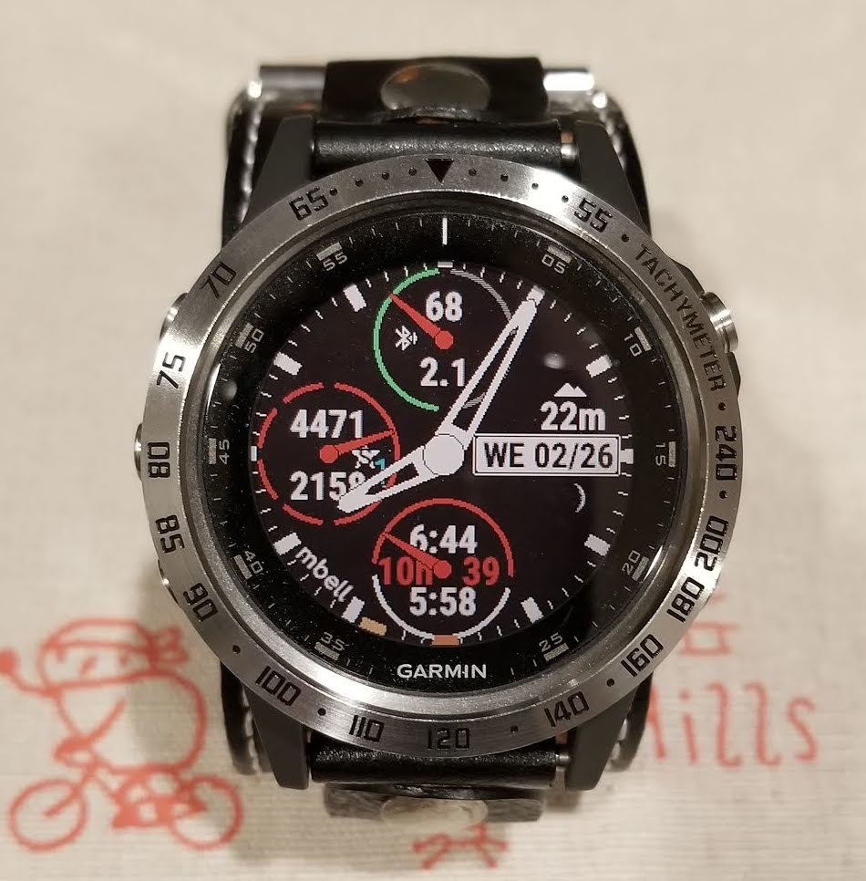
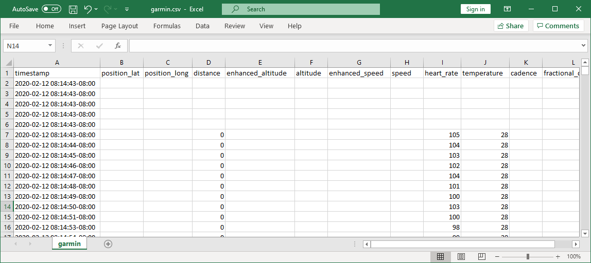

# FIT-to-CSV-converter-for-windows

The original code is from https://github.com/mcandocia/fit_processing
I did small modifications because the code is for Linux and the final csv file has empty line for each line of data. The modification that I did is in the end of write_fitfile_to_csv section. All credits is for mcandocia. 

First, you need to install Fitparse package. You can download it from: http://pythonhosted.org/fitparse/ the link in github is https://github.com/dtcooper/python-fitparse

After download go to the master directoy and look for setup.py using CMD windows terminal
in CMD run:

py setup.py install

Other libraries (CSV, OS and pytz) are installed with the basic Python 3 installation.
Now, place the FIT_to_CSV_forWin.py in the same location of the FIT file and the result will be CSV file with the same name.

Just run:

py FIT_to_CSV_forWin.py

P.D.
This code is intended to use for garmin file products, I tested it with Fenix 5 Plus watch. The workout file from the Fenix 5 is XXX.FIT and this one is binary. The Fitparse package extract all data to the ram memory and using message we get access to the raw data.  
